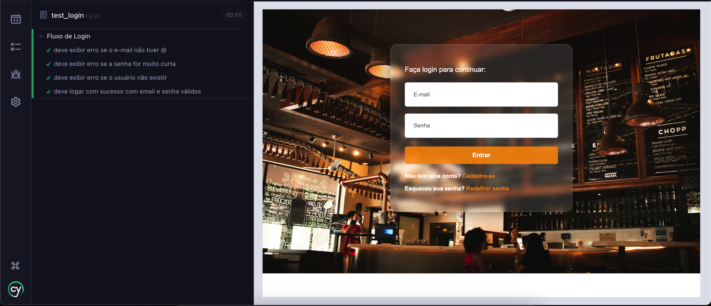
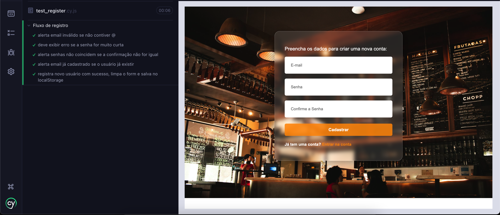
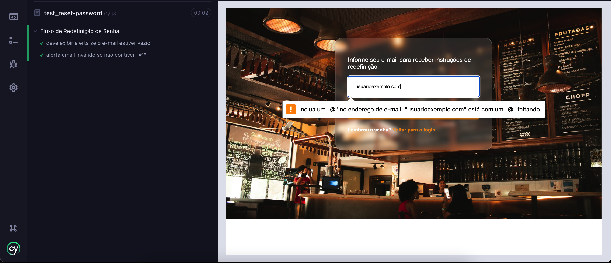

# Evidências / simple-login-system

## Login

A001
Cenário: Email sem @
Entrada: email: `usuario.com`, senha: `123456`
Resultado esperado: Alertar `Digite um endereço de e-mail.`
Resultado obtido: Mensagem exibida corretamente.

A002
Cenário: Senha menor que 6 caracteres
Entrada: email: `usuario@exemplo.com`, senha: `123`
Resultado esperado: Alertar `A senha deve ter pelo menos 6 caracteres.`
Resultado obtido: Mensagem exibida corretamente.

A003
Cenário: Email e senha que não estão no localStorage
Entrada: email: `usuario@exemplo.com`, senha: `123456`
Resultado esperado: Alertar `Email ou senha incorretos. Por favor, tente novamente.`
Resultado obtido: Mensagem exibida corretamente.

A004
Cenário: Email e senha que estão no localStorage
Entrada: email: `usuario@exemplo.com`, senha: `123456`
Resultado esperado: Alertar `Login bem-sucedido.`
Resultado obtido: Mensagem exibida corretamente.

## Registro

B001
Cenário: Email vazio
Entrada: email: "" (campo vazio), senha: `123456`, confirmar senha: `123456`
Resultado esperado: Alertar `Preencha este campo.`
Resultado obtido: Mensagem exibida corretamente.

B002
Cenário: Email sem @
Entrada: email: `usuario.com`, senha: `123456`
Resultado esperado: Alertar `Digite um endereço de e-mail.`
Resultado obtido: Mensagem exibida corretamente.

B003
Cenário: Senha menor que 6 caracteres
Entrada: email: `usuario@exemplo.com`, senha: `123`, confirmar senha: `123`
Resultado esperado: Alertar `A senha deve ter pelo menos 6 caracteres.`
Resultado obtido: Mensagem exibida corretamente.

B004
Cenário: Senhas não coincidem
Entrada: email: `usuario@exemplo.com`, senha: `123456`, confirmar senha: `654321`
Resultado esperado: Alertar `As senhas não coincidem.`
Resultado obtido: Mensagem exibida corretamente.

B005
Cenário: Email já cadastrado no localStorage
Entrada: email: `usuario@exemplo.com`, senha: `123456`, confirmar senha: `123456`
Resultado esperado: Alertar `Este email já está cadastrado.`
Resultado obtido: Mensagem exibida corretamente.

B006
Cenário: Registrar usuário novo válido 
Entrada: email: `usuario@exemplo.com`, senha: `123456`, confirmar senha: `123456`
Resultado esperado: Limpar o form e alertar `Usuário cadastrado com sucesso!`
Resultado obtido: Mensagem exibida corretamente.

## Recuperação de Senha

C001
Cenário: Email vazio
Entrada: email: "" (campo vazio)
Resultado esperado: Alertar `Preencha este campo.`
Resultado obtido: Mensagem exibida corretamente.

C002
Cenário: Email sem @
Entrada: email: `usuario.com`
Resultado esperado: Alertar `Digite um endereço de e-mail.`
Resultado obtido: Mensagem exibida corretamente.

C003
Cenário: Email válido
Entrada: email: `usuario@exemplo.com`
Resultado esperado: Alertar `Instruções de redefinição de senha enviadas para o seu email!`
Resultado obtido: Mensagem exibida corretamente.

C004
Cenário: Email inválido
Entrada: email: `usuarionaoexiste@exemplo.com`
Resultado esperado: Alertar `Este email não está cadastrado na nossa base.`
Resultado obtido: Mensagem exibida incorretamente. (Este cenário ainda não foi tratado)